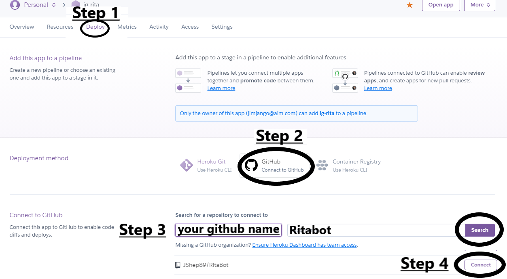
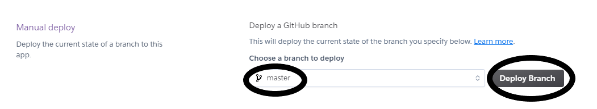
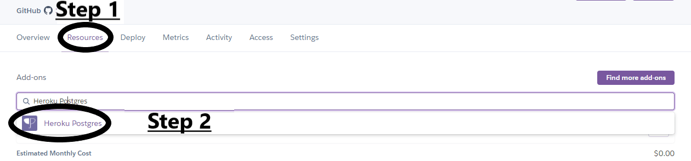
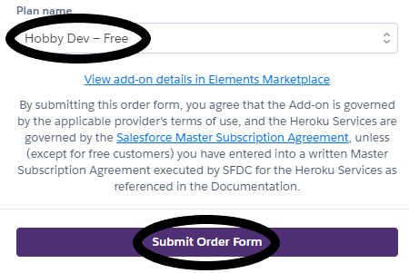
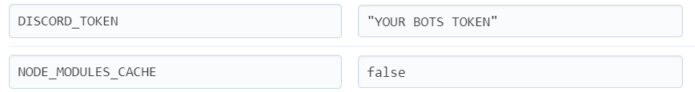
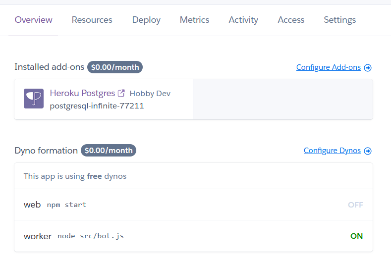

RITA is a an automatic translation bot built using `discord.js` and `Google Translate API`. From our desktops to yours.  

## Setting up a Bot Manually

**To deploy a free translation bot that you can add to your discord server, follow these easy steps.**

### Step 1 - Fork this repository
* If you don't yet have a Github account, [create one](https://github.com/join)! It's free and easy.
* Click [here](https://github.com/RitaBot-Project/RitaBot/fork) or click the icon below to fork our project.

  * <iframe src="https://ghbtns.com/github-btn.html?user=RitaBot-Project&repo=RitaBot&type=fork&count=true&size=large" frameborder="0" scrolling="0" width="170" height="30" title="GitHub"></iframe>

* While you're at it we would greatly appreciate adding a **star** to our project to promote RITA in Github for others to benefit too. You can do that by clicking the icon below and then clicking the ***Star*** image in the top-right corner of the [repo](https://github.com/RitaBot-Project/RitaBot).
  
  * <iframe src="https://ghbtns.com/github-btn.html?user=RitaBot-Project&repo=RitaBot&type=star&count=true&size=large" frameborder="0" scrolling="0" width="170" height="30" title="GitHub"></iframe>

### Step 2 - Create a new [Discord App](https://discordapp.com/developers/applications/me/create)
* Give your app the name you would like your bot to be then click **Create App**
  * *I like the name **C-3PO**, but feel free to pick something different if you fear George Lucas's wrath.*
* Copy the **CLIENT ID** of your bot, you will need it later
 
* Scroll down to the **Bot** section
* Click the **Create a Bot User** button
* Click the **Yes, do it!** button
* Copy the bot's **TOKEN**, you will need it later

    * **CLIENT ID** will be a string of numbers while your bots **TOKEN** will be a huge mix of letters and numbers.

### Step 3 - Create a Heroku account

*Heroku is a PaAs (platform as a service). They provide hosting services for free so this will be where your bot will be hosted. You can always run your bot locally or on a personal machine (though the hosting device would constantly need to allocate memory and power to the Bot for it to be online), look at [this page](https://ritabot.gg/local/) for more assistance*

* Create a new app. It's name must be unique and composed of all lowercase letters and dashes. Something like `yourname-discordbot` is fine
* Under **Deployment Method** select Github. Connect to your Github account and search for **RitaBot**, once it appears click on it to connect your fork.

* Scroll down to the manual deploy section, and make sure the **master** branch is selected. Click deploy branch, and wait for the successfully deployed message.

* Go to the **Resources** tab and look for the addons section. Search 'Heroku Postgres', and add 'Hobby Dev - Free' version of Heroku Postgres. This will be automatically attached as your bot's database.
  

* Go to the **Settings** tab. Click to reveal Config Variables, then add then add the following:

  * **KEY:** =  DISCORD_TOKEN
  * **Value:** = *Your discord bot's token that you copied earlier.*
  * **KEY:** =  NODE_MODULES_CACHE
  * **Value:** = false
    * *This is to ensure that when the bot updates it does not use any old Dependencies that Heroku has stored and gets fresh ones from the package.json file*

* Go to the **Overview** tab and click configure dynos. Turn off the default `web npm start` dyno and turn on the `worker node src/bot.js` dyno. Your bot will now be up and running!
  * Make sure to do this or your bot shall crash!

### Step 4 - Invite your bot to your server and configure it!
* Replace the **CLIENTID** string in the following URL with your own apps client id from Step 2
     * https://discordapp.com/oauth2/authorize?&client_id=**CLIENTID**&scope=bot&permissions=8
* Visit the resulting URL and add your bot to any server where you have admin privileges.

### Step 5 - Redeploy your bot
* Go back to [Heroku](https://heroku.com/) and go to the "Deploy" Section of your Heroku Application. Scroll down to 'Manual Deploy' and click deploy for the **master** branch. Once deployed type in the chat `!tr help` and then `!tr embed on` or `!tr embed off`. Then translate away ;)

