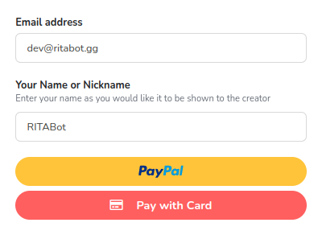
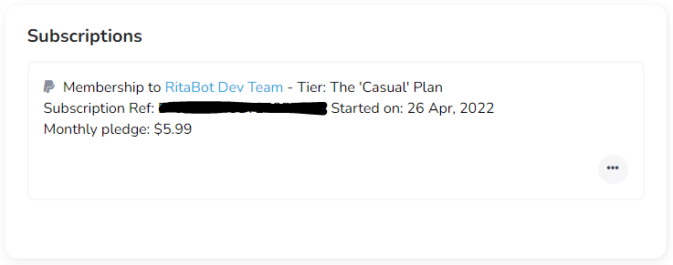

# Ko-Fi


If you need help at any point join our [**Discord Server**](https://discord.gg/mgNR64R) and someone will help you.



**BEFORE YOU START:** Ko-Fi requires you to make an account to link your discord account to, without doing this you will not be able to activate your subscription. You can create an account before you purchase, or after. More details can be found below.


## What is Ko-Fi

Ko-Fi is for Artists, Writers, Podcasters, and all kinds of creators. It can be a simple tip-jar, a place to build a membership community, or a super-easy way to sell products and commissions with just a link!\
\
We use it for membership benefits and discord integration. It allows us to reward members with unique benefits like Discord roles, exclusive content, or physical items.

## How to Subscribe

* Navigate to [Ko-Fi](https://ko-fi.com/ritabot)
* Locate the Tier that you wish to subscribe to.
* Select **Join**

.png>)

* Fill in your **Email Address** and **Your NickName** _(Please use your Discord Name)_
* Select **PayPal** or **Pay with Card**

* If you chose **PayPal**, sign in and confirm your payment.
* If you chose to **Pay with Card**, fill our your card details and continue

At this point, you will receive 1-3 emails. \
See [**Existing**](method-1.md#existing-ko-fi-account) or [**No Ko-Fi**](method-1.md#no-ko-fi-account) **** Account for next steps.

## Linking/Creating an Account - Before & After


We recommend making an account with Ko-Fi before you subscribe, but if you don't then don't worry, follow the steps below.


### Existing Ko-Fi Account

If you have an account but have not received your Discord Role then you need to link your Discord account.&#x20;

Log in to Ko-Fi, Select the Menu icon and then Discord from the list, Here you will see the below.

 

Once you have Authorized Discord you will get the "Successfully Connected to Discord" message,  you should receive the role within 15 mins, If you have not been given the "Subscriber" role within 15 mins then please open a ticket in our support server. &#x20;


Join our [**Discord Server**](https://discord.gg/mgNR64R) and #open-a-ticket if you have not been given 'Subscriber' role


### No Ko-Fi Account

If you have purchased a subscription and don't have a Ko-Fi account; don't worry, stop panicking. You will get 1-3 emails from Ko-Fi that look like these:

 


The "Manage Subscription" link may not always work, use "Confirm Your Payment"


Next, you need to "Confirm Your Payment" - This will take you to a page confirming your plan details. Click on the "Claim Discord Roles"&#x20;

You now need to create an account, select the option you want to use and create an account.&#x20;

 

Once you have Authorized Discord you will get the "Successfully Connected to Discord" message,  you should receive the role within 15 mins, If you have not been given the "Subscriber" role within 15 mins then please open a ticket in our support server. &#x20;


Join our [**Discord Server**](https://discord.gg/mgNR64R) and #open-a-ticket if you have not been given 'Subscriber' role


## Cancelling a Subscription

Cancelling can be done from within your Ko-Fi Account.

* Navigate to [https://ko-fi.com/account/](https://ko-fi.com/account/) (Sign in if required)
* On the left-hand side, under 'More ways to earn' select **More**
* Select **Account & Billing**
* You should now see **Subscriptions**

* You can now select the 3 tods in the bottom-right of the active subscription.
* Select **Don't Renew**

* On the next prompt, select the red **Yes, Cancel It** button

Your subscription is now cancelled subject to pro-rata. This means that your subscription will end on the next renewal date, allowing you to use the functionality for the remainder of the month.

