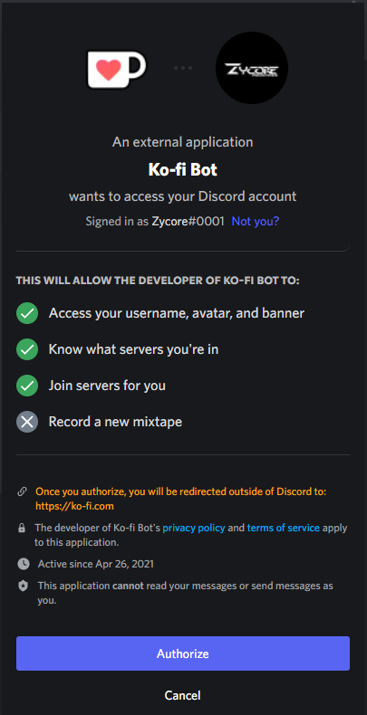
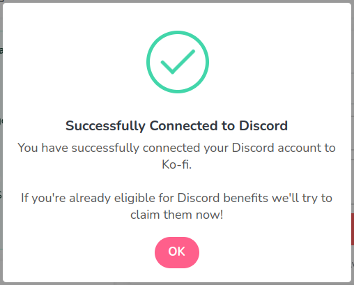
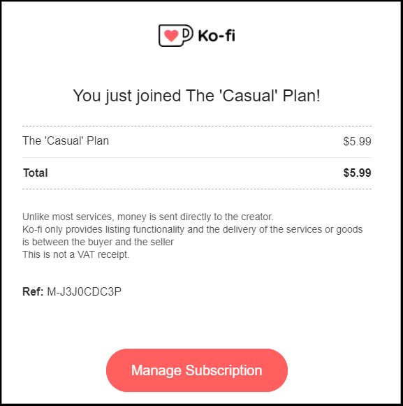
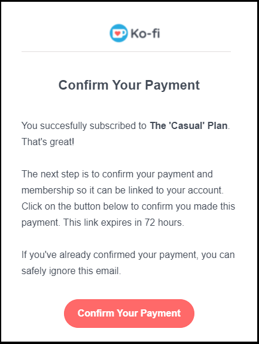
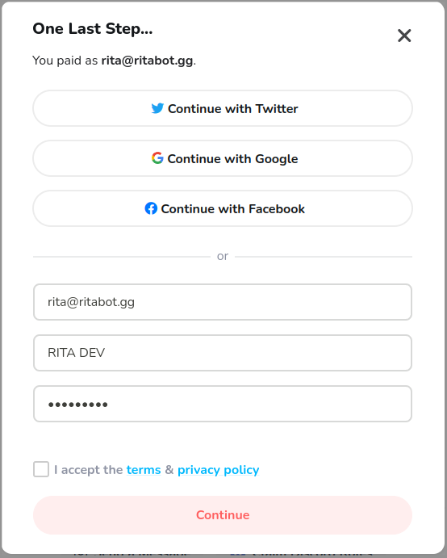
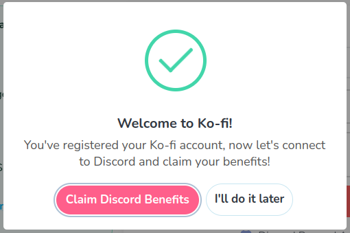

# Ko-Fi


If you want to subscribe with Ko-Fi then click [**here**](https://ko-fi.com/ritabot). \
If you need help at any point join our [**Discord Server**](https://discord.gg/mgNR64R) and someone will help you.



**BEFORE YOU START:** Ko-Fi requires you to make an account to link your discord account to, without doing this you will not be able to activate your subscription. You can create an account before you purchase, or after. More details can be found below.


## What is Ko-Fi

Ko-Fi is for Artists, Writers, Podcasters, and all kinds of creators. It can be a simple tip-jar, a place to build a membership community or a super-easy way to sell products and commissions with just a link!\
\
We use it for the membership benifits and discord intergration. It allows us to reward members with unique benefits like Discord roles, exclusive content or physical items.

## How to Subscribe

* Navigate to [https://ko-fi.com/ritabot](https://ko-fi.com/ritabot)
* Locate the Tier that you wish to subscribe to.
* Select **Join**

****.png>)****

* Fill in your **Email Address** and **Your Name**
* Select **PayPal** or **Pay with Card**

.png>)

* If you chose **PayPal**, sign in and confirm your payment.
* If you chose to **Pay with Card**, fill our your card details and continue

.png>)

At this point, you will receive 2 emails. the first is to confirm your payment.\
Select the big red button to do this, you will get a payment summary and a prompt in the top right-hand corner saying "Congratulations, you have confirmed your payment".

## Linking/Creating an Account - Before & After


We recommend making an account with Ko-Fi before you subscribe, but if you dont then dont worry, follow the steps below.


### If you have made an account on Ko-Fi already.

If you have an account but have not recived your Discord Role then you need to link your Discord Account.&#x20;

Log in to Ko-Fi, Select the Menu icon and then Discord from the list, Here you will see the below.

 

Once you have Authrized Discord you will get the "Successfully Connected to Discord" message,  you should recive the role within 15 mins, If you have not been given the "Subsciber" role within 15 mins then please open a ticket in our supoprt server. &#x20;


Join our [**Discord Server**](https://discord.gg/mgNR64R) and #open-a-ticket if you have not been given "Subsciber" role


### If you have purchased a subscription and don't have a Ko-Fi account.

Dont worry, Stop Panicing, You will get 2 email from Ko-Fi that look like these:

 


The "Manage Subscription" link may not always work, use "Confirm Your Payment"


Next you need to "Confirm Your Payment" - This will take you to a page confirming you plan details. Click on the "Claim Discord Roles"&#x20;

You now need to create an account, Select the option you want to use and create an account.&#x20;

 

Once you have Authrized Discord you will get the "Successfully Connected to Discord" message,  you should recive the role within 15 mins, If you have not been given the "Subsciber" role within 15 mins then please open a ticket in our supoprt server. &#x20;


Join our [**Discord Server**](https://discord.gg/mgNR64R) and #open-a-ticket if you have not been given "Subsciber" role


## Canceling a Subscription

## Error & FAQ

