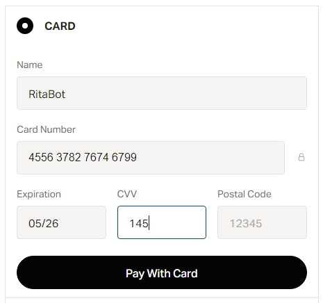
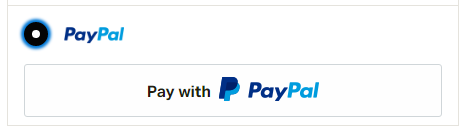
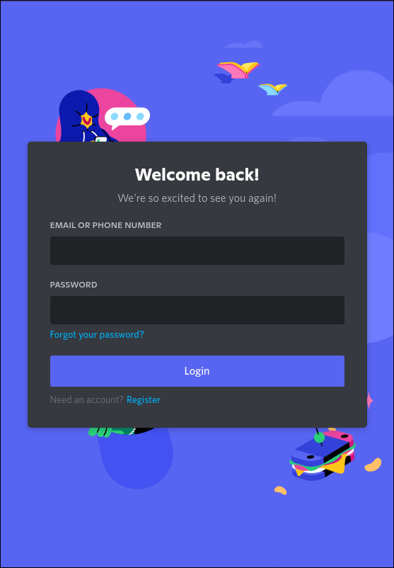
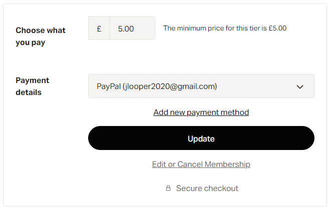

# Patreon

## What is Patreon

On Patreon, you can let your fans become active participants in the work they love by offering them a monthly membership. You give them access to exclusive content, community, and insight into your creative process. In exchange, you get the freedom to do your best work, and the stability you need to build an independent creative career.

## How to Subscribe

* Navigate to \<Insert link here>
* Select the plan that you wish to use by pressing **Join**

.PNG>)

* If you have an account with Patreon already, please select **Log-In** from the bottom of the page.
* If you don't have an account, You can **Sign up with Google or Facebook** or you can fill in the form and select **Sign Up** when you are done

.PNG>)

* For those creating new accounts. Confirm your **Country of Residence**
* **NOTE: DON'T FORGET TO VERIFY YOUR EMAIL**
* For those paying with a card, Select that option and fill out your details to process your payment.

Selecting **Pay with Card** will then process through and you will receive a confirmation by email.

* For those paying with PayPal, select this option, and then **Pay with PayPal**. You can then sign into PayPal.

 

* Once you have signed in, confirm your payment method and then **Agree and Continue**

As soon as you select continue as per the previous step, the payment will process and you will get a confirmation on screen that you were sucessful.

You can now link your Discord account to your patron. Scroll down until you see **Connect to Discord.** You can then sign in to discord and recieve your roles.

## Linking/Creating an Account - Before & After

Now you have a subscription with RITA, you can link your discord to get Roles. To do this either select **Connect to Discord** on the confirmation page, or go to your profile:

* Profile > Edit Profile > Connected Apps
* Select **Connect** on the Discord option

* Sign in as you normally would. Then select Authorise to confirm

*

## Cancelling a Subscription

To cancel a subscription, you will need to do this from within Pateon.

* Sign into Patron
* Navigate to your profile Menu
* Select **Manage Memberships**
* Locate RITA under **Active Memberships**

* Select **Edit** for the RITA membership
* Select **Edit for Cancel Membership**

* Select the **Cancel your Membership** option
* Select the black **Cancel your Membership** button to confirm

.PNG>)

Your membership will now be cancelled subject to Pro-Rata. This means your membership will end at the end of the month you paid for. If you have any issues or concerns, please open a ticket in the RITA Management Server.
