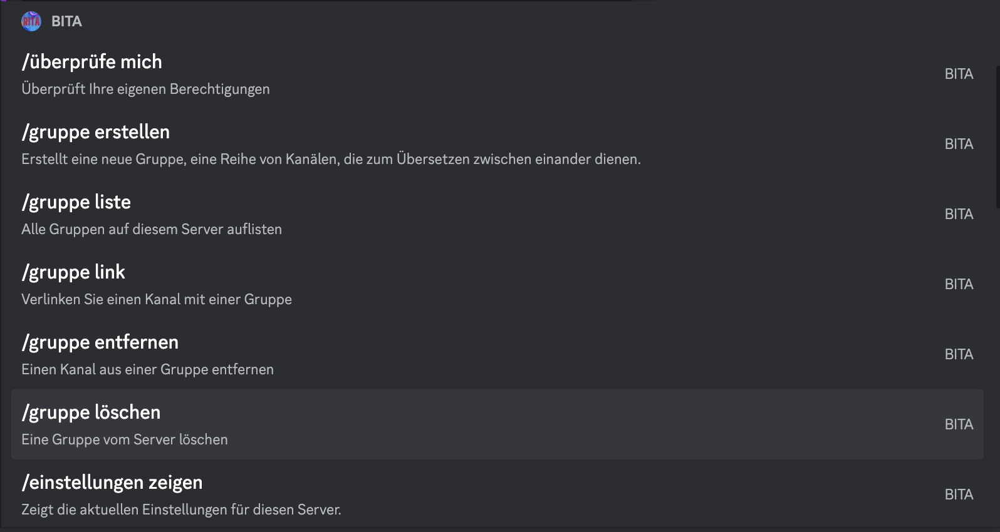
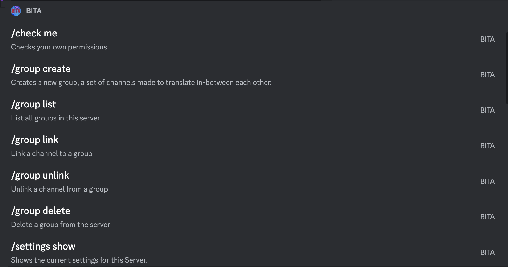

# 20/08/2023


**PLEASE NOTE:** This Update was accurate at the time of sharing. Please refer to our Support documentation to ensure accurate and up-to-date information is known, If you have any questions or concerns please join our [**Discord Server**](https://discord.gg/ritabot) and someone will assist.


## 1.4.3 Changes


```typescript
It has been a while since the last update, and we have been working in the background on a lot of little things, So here are some updates for you. 

* We have automated and streamlined our build pushes, now when we commit a build and it passes CI, a Restart will pull the update and the bot will load this new version.
* We have introduced a TRIAL Function, See below for more info.
* We have added 2 New Tiers for you to take advantage of, See below for more info.
* Our Debug and console messages have been cleaned up to allow for the identification of errors and contain more detail we need to source the issue and resolve it.
* We have greatly improved our Machine Learning Language Detection Algorithm, See below for more info.
* A Change was made to better support Custom Emoji and Server Emoji across RITA. A message should now show these in Translations.
* Fixed an issue with attachments embedding in auto tasks.
```


## COMING SOON - What's that you say, A FREE TRIAL!!


```typescript
COMING SOON - THIS IS NOT YET ACTIVE - COMING SOON

Yes, Yes, thats correct. We will soon have a trial Function.

* We will be introduceding a TRIAL Function allowing user to Try-Before-They-Buy.
* User do not need to be in RMS (RITA Managment Server) or patreon Account for it to work.
* If a user has an active sub already then the TRIAL wont Work.
* The TRIAL is Limited to 1 Trial Per Server Per User.
* TRIAL Users can create a maximum of 25 tasks and use 10k Characters across our ML Engine and Google API. 

To Activate a user just needs to invite RITA and run the TRIAL Command. !tr trial

COMING SOON - THIS IS NOT YET ACTIVE - COMING SOON

```


## 2 New Ways to Enjoy RITA&#x20;


```typescript
We heard you when you said that 350 tasks are not enough on our PRO Plan, and when you said that you don't need Channel Translation and only use Reactions, so we have a solution.

Reaction TIER - Do you just need the odd sentence or post translated here and there, You can translate as much as you want but flag reaction only, meaning you need to add a flag emoji to each message to translate it.
* Unlimited Flag Translations
* 0 Channel to Channel Translations
* 100k Characters Google API Limit

Ultima TIER - Our "Ultima" Plan is the highest plan we offer, with 550 tasks, and BITA Access for 1 Additional server, Allowing you to coordinate and translate even the largest servers going. 
* 550 Channel to Channel Translations
* 800k Characters Google API Limit
* Early Access to Development Features
* 1 Additional Server Support for our BITA Bot (See Below)
```



```typescript
OUR BITA Bot is a Testing and Development Platform, As such we test new functions and features on this BOT before launching on RITA. BITA only supports a handful of Languages so please reach out for information and to check if it will be suitable for you.
```


## Language Localisation


```typescript
We understand that not everyone that uses RITA understands English, so were trying to make it easier for you and your users. Starting now we are building, testing and trialing a Language Localisation System within RITA. Meaning all of her commands, Repsonces and prompts will be in the default language of your server. 

Here is a Examplpe:
```


<div>

<figure><figcaption><p>Slash Command shown in German</p></figcaption></figure>

 

<figure><figcaption><p>Slash Command shown in English</p></figcaption></figure>

</div>

<div>

<figure><figcaption><p>Help Menu shown in German</p></figcaption></figure>

 

<figure><figcaption><p>Help Menu shown in English</p></figcaption></figure>

</div>


```typescript
Now this function is extremely Experimental, and in the early stages of development. But we wanted to share this with exciting step we are taking with you.

In the coming week's we will be allowing community to support in translation efforts, with those who help us in our desired language receiving free RITA subscriptions from us as a thank you. We need to work out the fine details, but we will be utilising the crowdsource translation platform "Crowdin" to complete this work in. 
```


## A New Channel Translation Feature&#x20;


```javascript
Along with these changes, we have also introduced a "Filter" of sorts to the !tr channel command. 

You can now do the following

!tr channel from [lang] to [lang] for #[dest] filter @[role]

This will cause a task to only translate when someone with @role speaks in that channle and RITA will ignore all otehr messages, However she will still translate by Flag Reactions. 

At the moment this is only limited to "!tr channel" single command and does not work in the group command, however we are working on adding it soon. 
```


## Language Detection&#x20;


```javascript
While RITA core function is Translation, She needs to be able to identify what language you are providing as the input from the message you send to ensure it translates from the correct language to the correct language you want it too. 

Below are some of the numbers.

Average Word Accuracy: 61.387% > 69.009%
Average Pair Accuracy: 76.083% > 86.902%
Average Sentence Accuracy: 93.128% > 97.031%
```


## **Machine Learning (ML)**


```javascript
As we have talked about before, in 2022 we created our very own machine-learning translation model.

For those who aren’t familiar with this take a look at our Update from 06/04/22.

As part of our ongoing development of this API we have improved our Language Detection algorithm, This means that we correctly identify the source language you are trying to translate and the quality of our translation. 

The total character translated with RITA’s ML engine as of 01/01/2023 was 9,721,043
The total character translated with RITA’s ML engine as of 10/03/2023 was 103,624,447
The total character translated with RITA’s ML engine as of 14/08/2023 was 421,666,812

As you can see, We have Dramatically increased the Capacity of our ML Engine, in turn Increasing the Accuracy and Reliability of these translations.
```


## Version Command


```javascript
As a way to see all the changes we have made directly from RITA you can use the version command. The same as before but with a added twist. 

!tr version
!tr version [version number]
    eg: !tr version 1.4.3
    
The original command will still show you what version RITA is running, and the version number specific command will show you what changes have been made. 

Just a little way to keep you updated without constant posts about minor version changes. (Or fixes to bugs I have cause, although Qjuh is quickly catching up on me for breaking changes)
```




That's it for now, but we will have some more info for you when we can. and if you want to check out all the changes made, dive into our change logs over in Version History


From all the Development Team at RITA, See you soon.&#x20;


